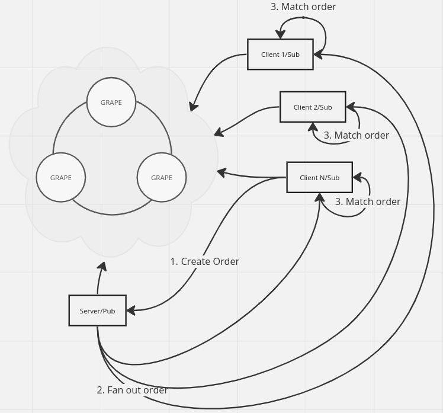

# simple_distributed_exchange

## Challenge
Your task is to create a simplified distributed exchange

* Each client will have its own instance of the orderbook.
* Clients submit orders to their own instance of orderbook. The order is distributed to other instances, too.
* If a client's order matches with another order, any remainer is added to the orderbook, too.

Requirement:
* Code in Javascript
* Use Grenache for communication between nodes
* Simple order matching engine
* You don't need to create a UI or HTTP API

Tips

 - you don't need to store state in a DB or filesystem
 - it is possible to solve the task with the node std lib, async and grenache libraries
 - beware of race conditions!
 - no need for express or any other http api layers

# Solution

 - Clients create new orders, which are sent to the server
 - Server receives the order, fan it out to connected clients
 - Each connected client receives the order and process it

# How to execute

Find both `server.js` and `client.js` in root folder.

 - `npm install` and start two grapes
 - Run server with `node server.js`
 - Run x number of clients with `node client.js`

# With more time

 - A more organized structure for orderbooks which would include closed orders (instead of just filtering them out of the current orderbook)
 - A more scalable way (O(log n)) of inserting orders into a sorted structured, instead of sorting them for every new order.
 - General error handling
